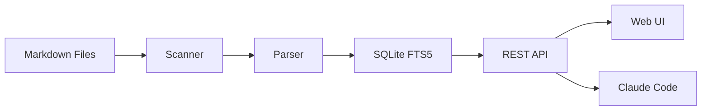
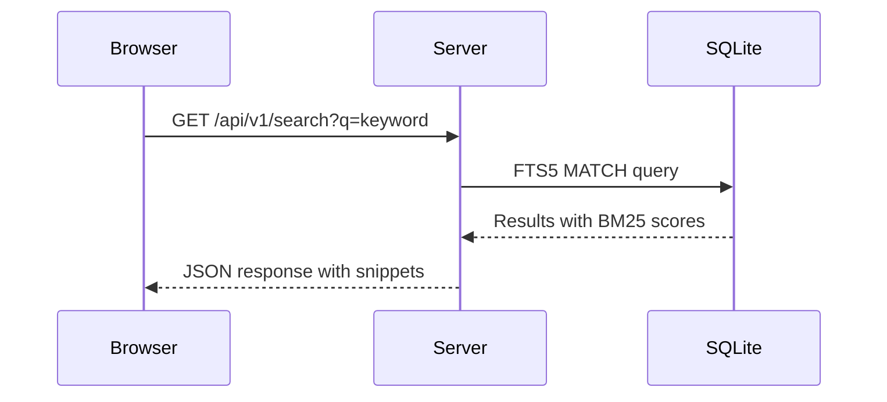
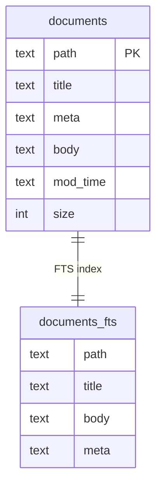

# Markdown 拡張機能デモ

このドキュメントでは KB が対応する Markdown の拡張機能をデモします。

## シンタックスハイライト

### Go

```go
func main() {
    http.HandleFunc("/api/v1/search", handleSearch)
    log.Fatal(http.ListenAndServe(":3000", nil))
}
```

### TypeScript

```typescript
interface SearchResult {
  path: string;
  title: string;
  snippet: string;
  score: number;
}

async function search(query: string): Promise<SearchResult[]> {
  const res = await fetch(`/api/v1/search?q=${encodeURIComponent(query)}`);
  return (await res.json()).data;
}
```

### Diff

```diff
 func (s *Store) ListTags() ([]TagCount, error) {
-    rows, err := s.db.Query("SELECT meta FROM documents")
+    rows, err := s.db.Query("SELECT meta FROM documents WHERE meta IS NOT NULL")
     if err != nil {
         return nil, err
     }
+    defer rows.Close()
 }
```

### SQL

```sql
SELECT path, title,
       snippet(documents_fts, 1, '<b>', '</b>', '...', 32) AS snippet,
       bm25(documents_fts, 10.0, 1.0) AS score
FROM documents_fts
WHERE documents_fts MATCH ?
ORDER BY score
LIMIT ? OFFSET ?;
```

### Dockerfile

```dockerfile
FROM golang:1.23-alpine AS builder
WORKDIR /app
COPY go.mod go.sum ./
RUN go mod download
COPY . .
RUN CGO_ENABLED=0 go build -o /kb ./cmd/kb
```

## Mermaid ダイアグラム

### フローチャート



### シーケンス図



### ER 図



## Wiki リンク

KB 内のドキュメントへのリンク:

- [[architecture/overview]] — アーキテクチャ概要
- [[guides/search-tips]] — 検索のコツ
- [[api/rest-endpoints]] — REST API リファレンス
- [[architecture/fts5-design|FTS5 の詳細設計]] — ラベル付きリンク

## メッセージブロック

:::message
これは通常のメッセージです。お知らせや補足情報に使います。
:::

:::info
`:::info` でも同じスタイルになります。技術的な情報を伝えるのに適しています。
:::

:::tip
**ヒント**: `kb serve --open` でブラウザが自動的に開きます。
:::

:::warning
注意: インメモリデータベースを使用しているため、サーバ再起動時にインデックスが再構築されます。
:::

:::danger
**危険**: `--force` フラグは既存のインデックスを完全に削除します。本番環境では使用しないでください。
:::

## 関連

- [[guides/getting-started]] - セットアップガイド
- [[architecture/overview]] - 技術設計
